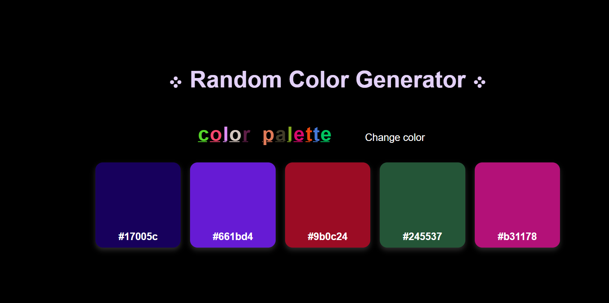

# 🎨 Color Palette Generator

A simple and fun web app that generates random color palettes with just one click.  
Perfect for designers, developers, and anyone who loves colors! 🌈

---

## 🔗 Live Demo

[See it live!](https://codebygunjan.github.io/Color-Palette-Generator/)

---

## 📸 Demo

---

## ✨ Features

- Generate random color palettes instantly
- Copy hex color codes with a single click
- Clean and minimal UI
- Responsive design (works on all devices)

---

## 🚀 How to Use

1. Clone the repo - https://github.com/codebygunjan/Color-Palette-Generator.git

2. Click on the **change color** button
3. A fresh set of random colors will appear
4. Copy the hex code and use it in your projects 🎨

---

## 🛠 Tech Stack

- HTML5
- CSS3
- JavaScript + DOM

---

## 🍂 Author

Gunjan Khudaniya!
